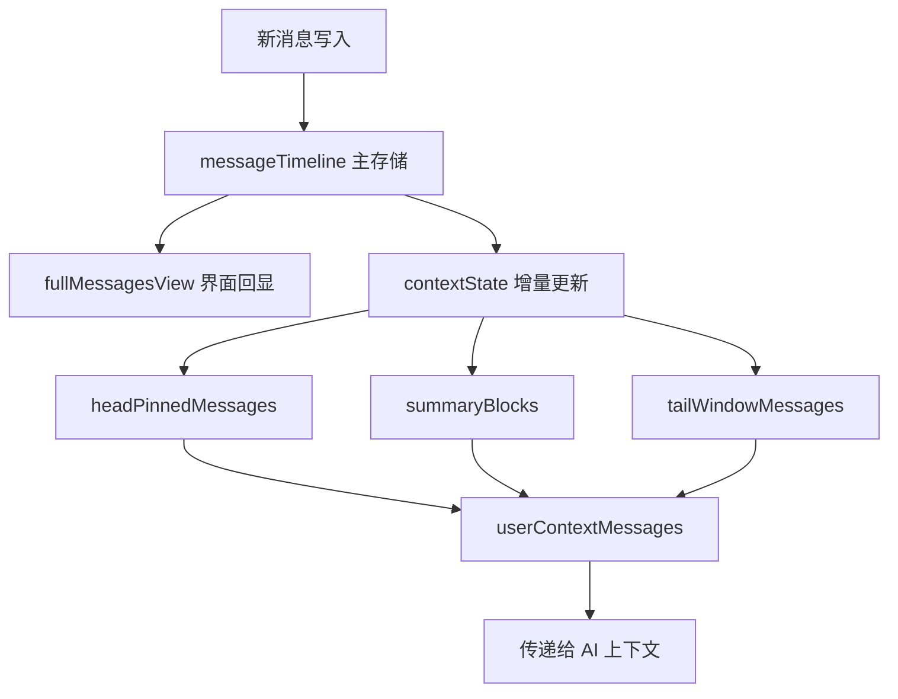

## Plan: ConversationStore 存储设计

推荐采用“一份主存储 + 两份派生视图 + 一份压缩状态”的方案：主存储保存完整消息事实，完整消息列表直接服务界面回显；用户消息列表不独立重复存整份消息体，而是维护一份面向模型输入的派生上下文列表，并为后续上下文压缩预留 summary、窗口边界和压缩版本信息，避免双写失真。

**Steps**
1. 定义主存储 `messageTimeline`：按时间顺序保存当前会话全部消息，覆盖 `user/assistant/system/tool` 全角色，并保留渲染与持久化需要的完整元信息。这个列表是单一事实来源。
2. 定义界面读模型 `fullMessagesView`：优先设计成从 `messageTimeline` 派生的只读视图，而不是第二份独立数组。若后续界面需要高频局部更新，可缓存派生结果，但不能成为真实源。
3. 定义模型输入存储 `contextState`：内部包含 `userContextMessages`、`summaryBlocks`、`headPinnedMessages`、`tailWindowMessages` 等分段结构。`userContextMessages` 只保留需要传给 AI 的消息子集与规范化内容。
4. 将“用户消息列表”设计成可压缩结构，而不是简单过滤后的数组：需要额外保存 `compressionVersion`、`compressedUntilSeq`、`lastBuildAt`、`tokenEstimate`，为后续摘要压缩、滑动窗口、系统提示保留位做准备。
5. 为每条主消息补充轻量索引和标记信息，例如 `seq`、`role`、`senderType`、`includedInContext`、`summaryGroupId`、`tokenUsage`，以便从主存储快速构建上下文存储，而不必反复深拷贝全文。
6. 约束更新策略：所有写入先进入 `messageTimeline`，再触发 `contextState` 增量更新；禁止直接修改 `userContextMessages`。这样可以避免完整列表与 AI 上下文列表不一致。
7. 为后续持久化对齐 `AiSessionMessageDocument`：ConversationStore 内部变量命名和字段语义尽量复用 `role`、`seq`、`tokenUsage`、`content` 等现有模型字段，减少内存态与 Mongo 模型之间的转换成本。

**推荐内部变量**
1. `messageTimeline`
含义：完整消息事实源，给界面回显、落库、重建上下文都用它。
建议元素字段：
`seq`、`role`、`senderType`、`content`、`createdAt`、`tokenUsage`、`extra`
设计原则：
这是一份主数组，不能再维护另一份“完整消息真值”。

2. `fullMessagesView`
含义：给前端或界面直接消费的完整消息列表。
建议：
默认设计成 getter 或派生缓存，不作为独立可写源。
原因：
否则你会同时维护两份完整消息，很快出现状态漂移。

3. `contextState`
含义：专门服务 AI 上下文构建的状态容器。
建议内部拆成：
`userContextMessages`
含义：真正传给模型的消息集合。
注意：
它不应该只保留 user 消息，通常还要包含必要的 `assistant/system/tool` 片段。
`summaryBlocks`
含义：历史压缩摘要块，后续用于上下文压缩。
`headPinnedMessages`
含义：固定保留在上下文头部的消息，比如 system prompt、会话规则。
`tailWindowMessages`
含义：最近窗口内的原始消息，保证模型拿到最新上下文。
`compressionMeta`
含义：压缩状态，例如 `compressionVersion`、`compressedUntilSeq`、`lastBuildAt`、`tokenEstimate`。

4. `messageIndexMeta`
含义：每条消息的轻量索引/标记。
建议内容：
`includedInContext`、`summaryGroupId`、`contextSegment`、`persisted`
原因：
未来做压缩、重建、增量同步时，不必每次扫全量消息并重新判断。

**为什么不建议直接维护“两份数组”**
如果你把“完整消息列表”和“用户消息列表”都做成独立可写数组，短期简单，后期一定出问题：
1. 新增一条 tool 或 assistant 消息时，容易漏同步其中一份。
2. 做上下文压缩时，用户消息列表会发生重排或摘要替换，和完整列表天然不再一一对应。
3. 后续落库和恢复内存状态时，双写会让恢复逻辑复杂很多。

所以更稳的结构是：
1. `messageTimeline` 作为单一事实源
2. `fullMessagesView` 作为完整回显视图
3. `contextState` 作为 AI 输入视图和压缩状态

**Relevant files**
- [chat-room-server/src/agent/memory/conversation-store.ts](chat-room-server/src/agent/memory/conversation-store.ts) — 目标会话管理器，当前为空，后续可按本方案落地内部变量与只读访问器
- [chat-room-server/src/models/aiSessionMessageModel.ts](chat-room-server/src/models/aiSessionMessageModel.ts) — 已定义 `role`、`content`、`tokenUsage`、`seq`，应作为主消息结构的字段参考
- [chat-room-server/src/agent/engine/main-agent.ts](chat-room-server/src/agent/engine/main-agent.ts) — 当前 agent 调用入口，后续 ConversationStore 输出的上下文消息需要对接模型调用参数

**Verification**
1. 检查设计是否满足两条独立读取路径：界面回显读取完整消息，模型调用读取上下文消息，且二者都能从单一事实源推导。
2. 模拟长会话场景，确认在加入 `summaryBlocks + tailWindowMessages` 后，不需要重写主存储结构即可支持上下文压缩。
3. 校验字段能否无损映射到 `AiSessionMessageDocument`，特别是 `seq`、`role`、`content`、`tokenUsage`、`extra`。
4. 校验 tool/system 消息不会在压缩或过滤中丢失必要顺序约束。

**Decisions**
- 完整消息列表采用单一事实源，不维护第二份独立“完整消息数组”作为真值。
- 用户消息列表不是简单 `role === user` 的过滤结果，而是“传给 AI 的上下文消息集”。
- 为后续上下文压缩预留显式状态字段，而不是等压缩需求出现后再重构。
- 当前范围只覆盖内部存储变量设计，不包含方法实现或控制器接入。

**流程图**

