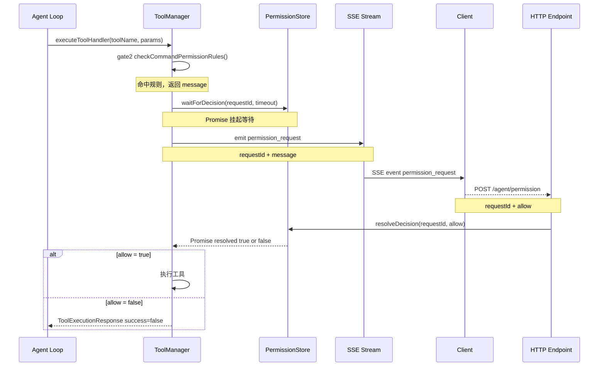

# Agent Loop 权限中断与恢复 设计方案

## 核心思路

用 **Promise 挂起 + requestId 映射** 实现异步暂停。Agent Loop 在执行工具前 `await` 一个 Promise，该 Promise 不会自行 resolve——只有外部收到用户的 allow/deny 信号后才会被解开。

---

## 数据流程图



---

## 模块职责与改动清单

### 新增文件

#### `src/agent/engine/permission-store.ts`

全局单例，管理所有待决的权限请求。

```ts
// 核心接口
class PermissionStore {
  waitForDecision(requestId: string, timeoutMs?: number): Promise<boolean>;
  resolveDecision(requestId: string, allow: boolean): void;
}
export const permissionStore = new PermissionStore();
```

- 内部用 `Map<requestId, { resolve, reject }>` 存储挂起的 Promise
- 支持超时（默认 60s），超时自动 deny，避免 Loop 永久挂起

---

### 修改文件

| 文件                                                | 改动内容                                                                                                                                             |
| --------------------------------------------------- | ---------------------------------------------------------------------------------------------------------------------------------------------------- |
| `premission.ts`                                     | 实现 `askUserForPermission`：生成 `requestId`，触发 `onPermissionRequest` 事件，调用 `permissionStore.waitForDecision`                               |
| `types/agent.ts`                                    | `EventHandler` 新增 `onPermissionRequest?(requestId, message): Promise<void>`                                                                        |
| `handlers/stream-handler.ts`                        | 实现 `onPermissionRequest`，写入 SSE 事件 `{ type: "permission_request", requestId, message }`                                                       |
| `engine/tool-manager.ts`                            | `executeToolHandler` 中在调用工具前插入 gate2+gate3；新增 `setEventHandler(handler)` 方法供 Loop 注入                                                |
| `engine/main-agent.ts`                              | 在调用 `executeToolHandler` 前，将当前轮次的 `EventHandler` 传给 `ToolManager`                                                                       |
| `routes/aiRoute.ts` + `controllers/aiController.ts` | **Koa + koa-router**：新增 `router.post('/agent/permission', agentPermission)`，接收 `{ requestId, allow }` 并调用 `permissionStore.resolveDecision` |

---

## Gate 3 在 ToolManager 中的插入位置

```
executeToolHandler(toolCallId, toolName, rawArgs)
  ↓
  [已有] 工具存在性检查
  ↓
  [新增 gate 2] checkCommandPermissionRules(toolName, params)
    → 无命中 → 正常执行
    → 命中    → askUserForPermission(message, eventHandler)
                  → 触发 SSE 通知客户端
                  → await permissionStore.waitForDecision(requestId)
                     → allow  → 继续执行工具
                     → deny   → return { success:false, error:"PermissionDenied: ..." }
  ↓
  [已有] tool.execute(params)
```

---

## 客户端感知的 SSE 事件（新增 1 个）

```json
{ "type": "permission_request", "requestId": "uuid", "message": "This action will overwrite..." }
```

客户端弹出确认框，用户点击后发：

```
POST /agent/permission
{ "requestId": "uuid", "allow": true }
```

路由侧（Koa）示例：

```ts
// routes/aiRoute.ts
router.post("/agent/permission", agentPermission);

// controllers/aiController.ts
export const agentPermission = async (ctx: Context) => {
  const { requestId, allow } = ctx.request.body as { requestId: string; allow: boolean };
  permissionStore.resolveDecision(requestId, allow);
  ctx.body = { ok: true };
};
```

---

## 关键设计决策说明

1. **requestId 全局唯一（UUID v4）**，不绑定 session，天然避免冲突
2. **超时自动 deny**，防止客户端断连导致 Loop 永久阻塞（默认 60s）
3. **deny 不抛异常到 Loop 顶层**，而是返回结构化的 `ToolExecutionResponse { success: false }`，让 LLM 看到工具失败信息后自行决策下一步（正常的 error recovery 路径）
4. **EventHandler 注入 ToolManager** 采用 `setEventHandler()` 方式，而非构造器传参，避免改动 ToolManager 初始化链
5. **PermissionStore 是独立模块**，与 gate2/gate3 解耦，未来可替换为 Redis 等分布式存储

---

## 待确认事项

- [x] 路由层框架：**Koa + koa-router**，新路由挂在 `routes/aiRoute.ts`，controller 在 `controllers/aiController.ts`
- [x] 超时默认值：**60s**
- [x] deny 处理方式：**返回结构化错误给 LLM**（`ToolExecutionResponse { success: false }`），不中断整个 Loop
